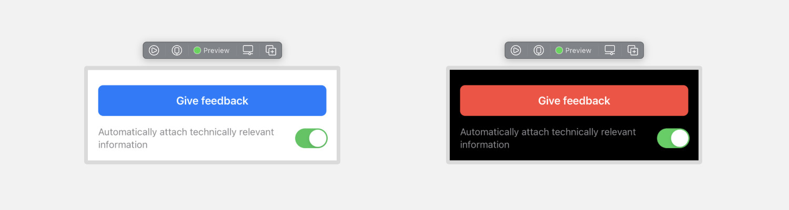

# AppFeedback

<p align="left">


</p>

Send email feedback from your iOS application. 

Currently there are english and german translations available for this package. Feel free to contribute another language. 

## Installation

Install `AppFeedback` with Swift Package Manager:

```swift
dependencies: [
    .package(name: "AppFeedback", url: "https://github.com/lambdadigamma/swift-app-feedback", .upToNextMajor(from: "1.0.0")),
]
```

## Documentation

To use the `AppFeedback` user interface and the default setup, 
you just need to create a `FeedbackViewController` with a `FeedbackConfiguration`.

```swift 
import AppFeedback

let configuration = FeedbackConfiguration(
    receiver: "info@example.org",
    subject: "Feedback",
)

let viewController = FeedbackViewController(configuration: configuration)

self.navigationController.pushViewController(viewController, animated: true)
```

### Feedback configuration

The feedback has a few configuration options.
…

### Changing the copy of the views

You can easily swap or change all texts (e.g. title, button, help text, etc.) by passing a `StringResolver` with the `Bundle` containing your own strings.

> ⚠️ Attention
> If you want to customize strings by providing a custom string resolver, make sure to provide a string for every key into your `Localizable.strings` file.
> You can find the latest strings used by this package [here](Sources/AppFeedback/Resources/en.lproj/Localizable.strings).


### Use custom button color



To provide a custom button color you can customize the `buttonAppearance` of the feedback configuration.

Just initialize a ButtonAppearance and pass it into the configuration.
```swift
let buttonAppearance = ButtonAppearance(
    backgroundColor: .red, 
    foregroundColor: .white
)

let configuration = FeedbackConfiguration(
    …,
    buttonAppearance: buttonAppearance
)
```


### Provide your own feedback data

You can easily attach your own feedback to the email by passing an object that conforms to the `FeedbackDataCollecting` protocol into the `FeedbackViewController`.

This protocol only requires you to implement a `collect()` method which returns an array of strings.

### Providing a custom view and subclassing the view controller

You can also create your own subclass of `FeedbackViewController`.
All of the actions and also the view setup can be overwritten.

See [`FeedbackViewController`](Sources/AppFeedback/UI/FeedbackViewController.swift) to learn what to override.

## Roadmap

- [x] Implement a default feedback overview screen
- [x] Make feedback overview customizable
- [x] Add accessibility identifiers for all controls
- [ ] Make feedback overview even more customizable
- [ ] Support more localizations
- [ ] Support data attachments
- [ ] Support more platforms (e.g. macOS and Catalyst)

## Changelog

Please see `CHANGELOG.md` for more information what has changed recently.

## Contributing

Contributions are always welcome!

## Credits

- [Lennart Fischer](https://github.com/lambdadigamma)
- [opensource.org](https://opensource.org/licenses)
- [All Contributors](https://github.com/lambdadigamma/swift-app-feedback/graphs/contributors)

## License

`swift-app-feedback` is available under the MIT license. See the `LICENSE.md` file for more info.
